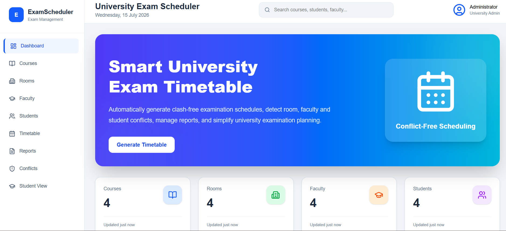
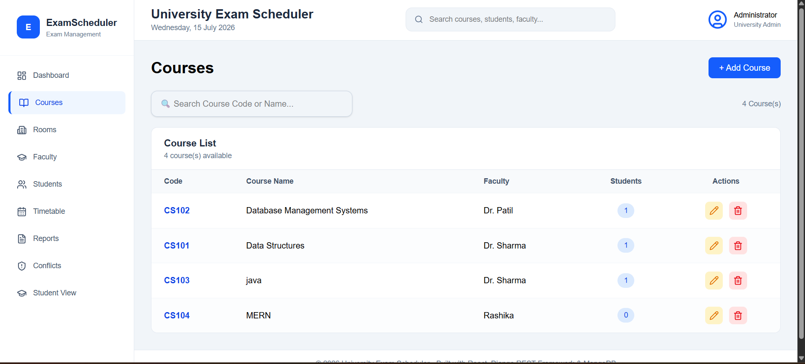
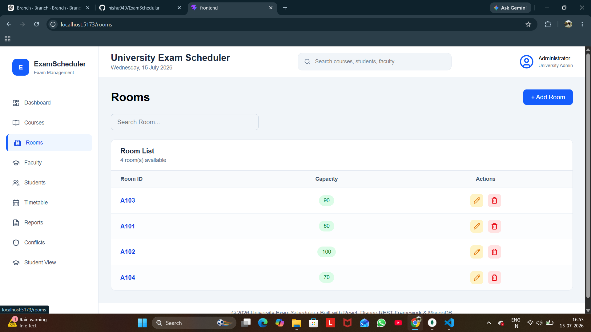
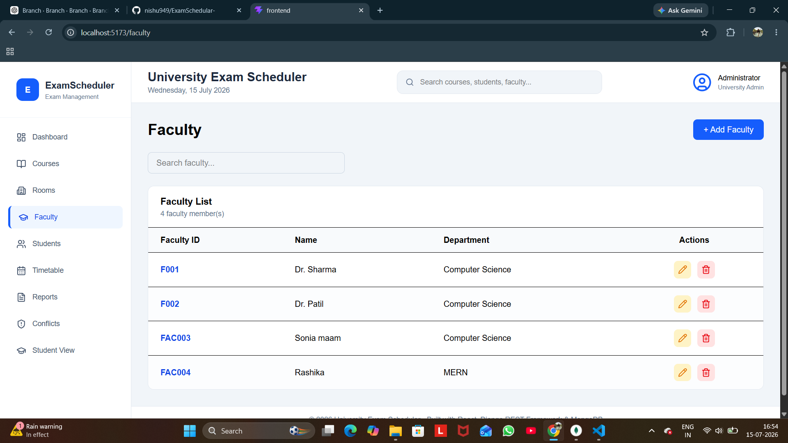
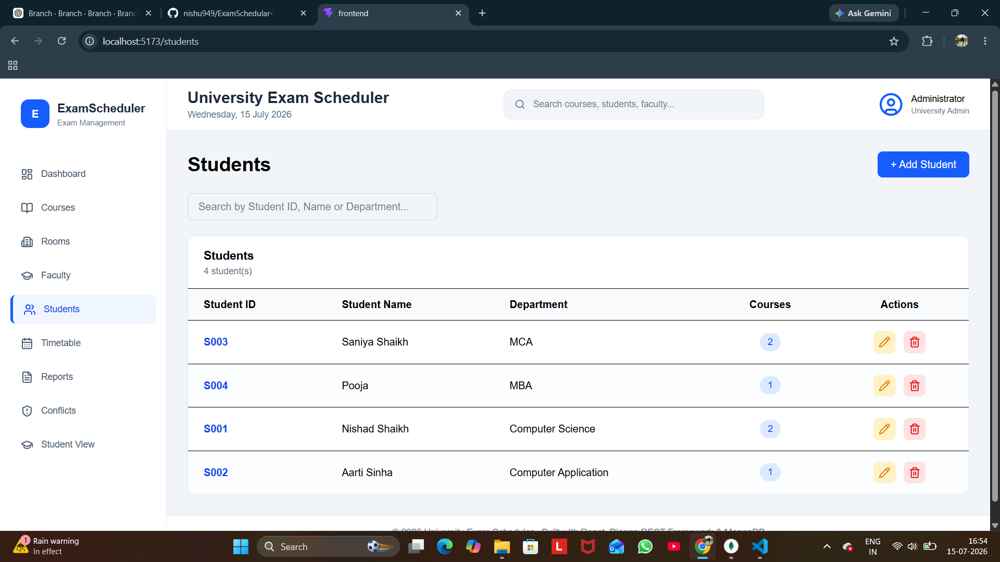
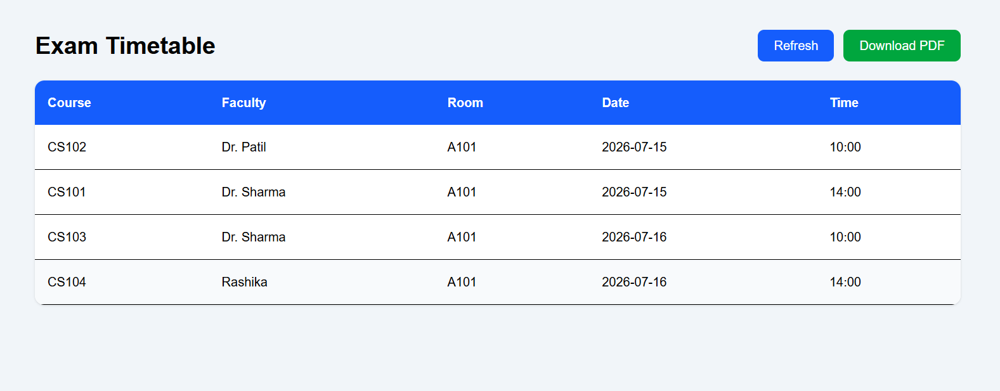
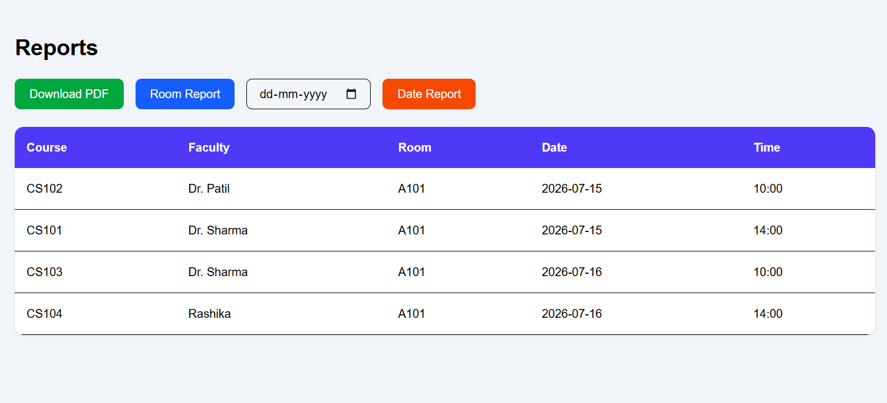

#  University Exam Scheduler

A modern **University Exam Timetable Generator & Conflict Resolver** built using **Django REST Framework, React, MongoDB, and Tailwind CSS**.

The system automatically generates conflict-free university examination schedules by assigning courses, rooms, faculties, and time slots while ensuring scheduling constraints are satisfied.

---

# 📌 Project Overview

Managing university examinations manually is time-consuming and error-prone. This project automates the complete examination scheduling process.

The system allows administrators to:

- Manage Courses
- Manage Rooms
- Manage Faculty
- Manage Students
- Generate Exam Timetable
- Detect Scheduling Conflicts
- Download Reports
- View Student Schedule

The scheduling engine ensures that:

- No student has two exams at the same time.
- No room is double-booked.
- Faculty availability is respected.
- Time slots are assigned automatically.
- Reports are generated instantly.

---

# ✨ Features
# Authentication

The application supports **Role-Based Authentication**.

There are two user roles:

- Administrator
- Student

---

## Administrator Login

After registering an administrator, log in using:

```
Username : admin
Password : 123456
```

Sample Request

```json
POST /api/admin/login/

{
    "username": "admin",
    "password": "123456"
}
```

Sample Response

```json
{
    "success": true,
    "role": "admin",
    "username": "admin",
    "email": "admin@gmail.com"
}
```

---

## Student Login

After registering a student, log in using:

```
Student ID : S010
Password   : 123456
```

Sample Request

```json
POST /api/student/login/

{
    "student_id": "S010",
    "password": "123456"
}
```

Sample Response

```json
{
    "success": true,
    "role": "student",
    "student_id": "S010",
    "student_name": "Rahul Sharma",
    "department": "Computer Engineering"
}
```

---

## Administrator Registration

Sample Request

```json
POST /api/admin/register/

{
    "username": "admin",
    "email": "admin@gmail.com",
    "password": "123456"
}
```

Sample Response

```json
{
    "success": true,
    "message": "Admin registered successfully"
}
```

---

## Student Registration

Sample Request

```json
POST /api/student/register/

{
    "student_id": "S010",
    "student_name": "Rahul Sharma",
    "department": "Computer Engineering",
    "password": "123456"
}
```

Sample Response

```json
{
    "success": true,
    "message": "Student registered successfully"
}
```

---

## Role-Based Navigation

### Administrator

After successful login, administrators are redirected to:

```
/dashboard
```

Administrator Features:

- Dashboard
- Courses
- Rooms
- Faculty
- Students
- Timetable
- Reports
- Conflict Detection
- Student Schedule View
- Logout

---

### Student

After successful login, students are redirected to:

```
/student-dashboard
```

Student Features:

- View Personal Dashboard
- View Complete Exam Schedule
- View Course Details
- View Room Details
- View Exam Date & Time
- Logout

Students cannot access administrator modules.

## Administrator

- Dashboard
- Manage Courses (CRUD)
- Manage Rooms (CRUD)
- Manage Faculty (CRUD)
- Manage Students (CRUD)
- Auto Generate Timetable
- Conflict Detection
- Download Reports
- Student Schedule View

---

## Student

Students can:

- View Personal Exam Schedule
- View Course
- View Exam Date
- View Exam Time
- View Room Number
- View Faculty

---

# 🚀 Technologies Used

## Frontend

- React.js
- Vite
- Tailwind CSS
- Axios
- React Router DOM
- Lucide React Icons

---

## Backend

- Python
- Django
- Django REST Framework
- MongoEngine
- MongoDB

---

## Database

MongoDB

Collections:

- Courses
- Rooms
- Faculty
- Students
- Timetable

---

# 📂 Project Structure

```
EdTech
│
├── backend
│   ├── backend
│   ├── exam_scheduler
│   │   ├── scheduler.py
│   │   ├── serializers.py
│   │   ├── models.py
│   │   ├── urls.py
│   │   ├── views.py
│   │   └── report.py
│   │
│   └── manage.py
│
├── frontend
│   ├── src
│   │
│   ├── components
│   ├── layouts
│   ├── pages
│   ├── services
│   └── App.jsx
│
└── README.md
```

---

# ⚙ Installation Guide

---

## 1 Clone Repository

```bash
git clone https://github.com/yourusername/EdTech.git

cd EdTech
```

---

# Backend Setup

## Create Virtual Environment

```bash
python -m venv venv
```

Activate

### Windows

```bash
venv\Scripts\activate
```

### Linux / Mac

```bash
source venv/bin/activate
```

---

## Install Python Packages

```bash
pip install django

pip install djangorestframework

pip install mongoengine

pip install pymongo

pip install django-cors-headers

pip install reportlab
```

or

```bash
pip install -r requirements.txt
```

---

# MongoDB Setup

Install MongoDB

Start MongoDB Server

Windows

```bash
mongod
```

MongoDB Compass

Connect

```
mongodb://localhost:27017
```

Database

```
exam_scheduler_db
```

Collections will be created automatically.

---

# Configure MongoDB

settings.py

```python
from mongoengine import connect

connect(
    db="exam_scheduler_db",
    host="mongodb://localhost:27017/exam_scheduler_db"
)
```

---

# Run Backend

```bash
cd backend

python manage.py runserver
```

Backend runs on

```
http://127.0.0.1:8000
```

---

# Frontend Setup

Go to frontend

```bash
cd frontend
```

Install packages

```bash
npm install
```

---

Install dependencies

```bash
npm install axios

npm install react-router-dom

npm install lucide-react

npm install tailwindcss

npm install @tailwindcss/vite
```

---

Run Frontend

```bash
npm run dev
```

Frontend runs on

```
http://localhost:5173
```

---
## 🌐 Deployment Details
# API Endpoints
# Live URLs
```
Service	          URL

Frontend	      https://exam-scheduler-frontend-2elg.onrender.com
Backend API       https://examschedular-edtech.onrender.com
Swagger Docs	  https://exam-scheduler-api.onrender.com/swagger/
```

## Complete URLs
```
Service           |      	URL

🌐 Frontend                https://exam-scheduler-frontend-2elg.onrender.com
🔧 Backend API	           https://examschedular-edtech.onrender.com
Dashboard	               https://examschedular-edtech.onrender.com/api/dashboard/
Courses	                   https://examschedular-edtech.onrender.com/api/courses/
Rooms	                   https://examschedular-edtech.onrender.com/api/rooms/
Faculty	                   https://examschedular-edtech.onrender.com/api/faculties/
Students	               https://examschedular-edtech.onrender.com/api/students/
Timetable	               https://examschedular-edtech.onrender.com/api/timetable/
```
## Deployment Configuration
# Backend (Render Web Service)
```
Setting	Value :

Name	             exam-scheduler-api
Root Directory	     backend
Build Command	     ./build.sh
Start Command	     gunicorn backend.wsgi:application

```

# Frontend (Render Static Site)

```
Setting	            Value
Name	            exam-scheduler-frontend
Root Directory	    frontend
Build Command	    npm install && npm run build
Publish Directory	build
```
# Test Credentials
```
Role	         Username/ID	        Password
Admin	         admin	                admin123
Student	         S001	                student123
```

## Dashboard

```
GET /api/dashboard/
```

Response

```json
{
  "courses": 25,
  "rooms": 10,
  "faculties": 30,
  "students": 240,
  "timetable": 25
}
```

---
## 📡 API Endpoints
## Courses

### GET

```
GET /api/courses/
```

### POST

```
POST /api/courses/
```

Sample JSON

```json
{
  "course_code": "CS101",
  "course_name": "Data Structures",
  "faculty_name": "Dr. Smith",
  "semester": 3
}
```

---

## Rooms

```
GET /api/rooms/
```

```json
{
  "room_id": "A101",
  "capacity": 60
}
```

---

## Faculty

```
GET /api/faculty/
```

```json
{
  "faculty_name": "Dr. John",
  "availability": true
}
```

---

## Students

```
GET /api/students/
```

Sample JSON

```json
{
  "student_id": "S001",
  "student_name": "John",
  "department": "Computer Engineering",
  "enrolled_courses": [
    "CS101",
    "CS102"
  ]
}
```

---

## Generate Timetable

```
POST /api/generate/
```

Response

```json
{
    "message":"Timetable Generated Successfully"
}
```

---

## Timetable

```
GET /api/timetable/
```

Response

```json
{
  "course_code": "CS101",
  "exam_date": "2026-08-15",
  "exam_time": "10:00 AM",
  "room_id": "A101",
  "faculty": "Dr. John"
}
```

---

## Conflict Detection

```
GET /api/conflicts/
```

Response

```json
{
    "status":"No Conflicts"
}
```

---

## Reports

```
GET /api/report/
```

Downloads PDF Report

---

# Scheduling Workflow

```
Administrator

        │

        ▼

Add Courses

        │

        ▼

Add Rooms

        │

        ▼

Add Faculty

        │

        ▼

Add Students

        │

        ▼

Generate Timetable

        │

        ▼

Constraint Checking

        │

        ▼

Conflict Detection

        │

        ▼

MongoDB Storage

        │

        ▼

Reports & Student View
```

---

# Case Study Mapping

| Case Study Requirement | Status |
|-------------------------|--------|
| University Exam Timetable Generator | ✅ |
| Conflict Resolver | ✅ |
| Dictionary for Course-Time Mapping | ✅ |
| Lists for Room Allocation | ✅ |
| Conditional Conflict Detection | ✅ |
| Datetime Slot Generation | ✅ |
| Exception Handling | ✅ |
| Custom Scheduler Module | ✅ |
| Course Class | ✅ |
| Room Class | ✅ |
| Schedule Engine | ✅ |
| Regex Validation | ✅ |
| Multithreading | ✅ |
| MongoDB CRUD | ✅ |
| Query by Date | ✅ |
| Query by Room | ✅ |
| Admin Dashboard | ✅ |
| Student View | ✅ |
| Report Download | ✅ |
| DRF REST API | ✅ |

---

# Screenshots
## Admin Login 
## Dashboard



---

## Courses




## Rooms



---

## Faculty



---

## Students



---

## Timetable



---

## Reports




---
## Platform
Hosting Provider: Render

Database: MongoDB Atlas

Repository: GitHub
# Future Enhancements

- Email Notifications
- SMS Alerts
- Excel Report Export
- JWT Authentication
- Multi-University Support
- AI-based Seat Allocation
- Mobile Application

---

# Authors

**Nishad Shaikh**

Master of Computer Application

---

# License

This project is develop for educational purposes.
